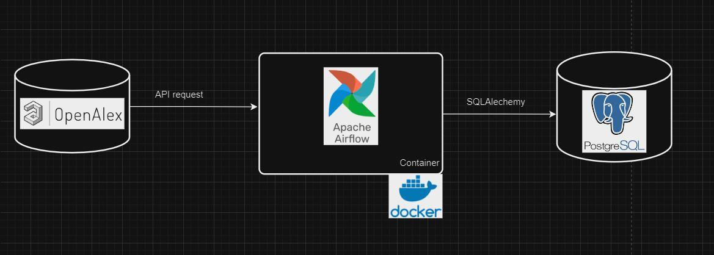
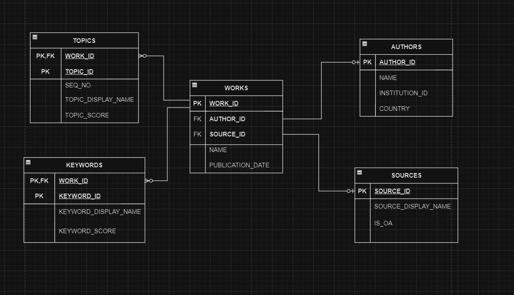
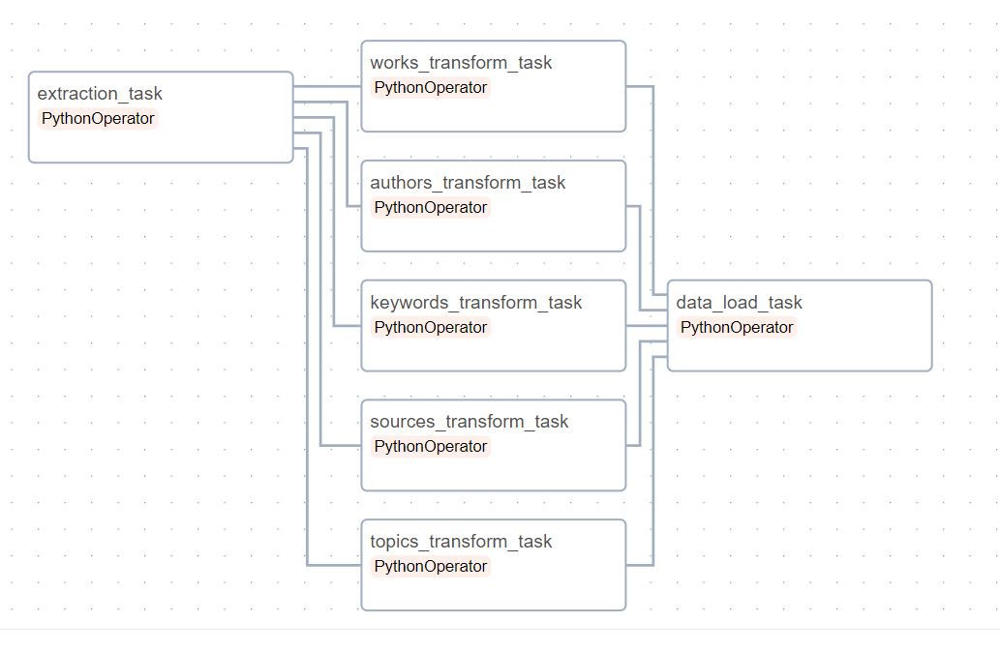

# Research works pipeline
The vast and expanding dataset of research publications offers opportunities to derive insights into trends in publication, emerging fields of innovation, and the pace of research development. 
This project is a data pipeline that extracts data, related to works on "artificial intelligence", from the open access catalog of research works, [OpenAlex](https://openalex.org/), to a local relational database repository. The pipeline is written in Python (with Pandas), orchestrated using Airflow on Docker containers hosted on local machine and the database used is PostgreSQL. The current scope of the pipeline design is to serve a visualization layer, which can help a user gain insights.
## Data
The data source is the OpenAlex API for works data which comes in a JSON format. This is the API [documentation](https://docs.openalex.org/api-entities/works). The data consists of information regarding research works along with their associated author, source, topics and keywords.  
Source represents the location such as the journal and related attributes like whether it is open access or not.  
Topics are groups classfied by OpenAlex's algorithm which are determined by the content of the work. At most, 3 closely related topics are assigned to a work along with its relavance score ("topics_score").
Keywords are short phrases which are also assigned by OpenAlex's algorithm.
## Pipeline architecture

## Data Model
The data is modeled into 5 tables- works, authors, sources, topics and keywords. 

To elaborate on the relations, each work has a "first" author and primary location. The extended details of these entities are stored in the "authors" and "sources" tables respectively. Moreover, a work may have multiple (or none) topics and keywords and, the details regarding them are stored in the "topics" and "keywords" tables respectively. 
## Pipeline
The pipeline is split into units of extraction, multiple transformations and database load. The orchestration of the same as done on Airflow as a DAG is shown below (read left to right). 

The extraction task gets the works JSON data from the API and archives it for processing in the next steps.

Each of the transformation task, one for each entity, transforms the raw JSON data to processed JSON ready to be written to the database. The transformation is achieved using the Pandas library. The processed JSON is archived to be used in the data load task.

The data load task reads the processed JSON data for all the 5 tables and "upserts" them as incremental data load. The 5 tables are written as an atomic transaction.